# 架空地図制作の歩み

多田 瑛貴は架空地図が趣味で、小学校時代から数え切れないほど地図を描いてきました。 
しかし、今までそれらをしっかりと保管できていなかったため、多くの資料を紛失してしまっています。 
そこで、過去の自分の作品をアーカイブすることの重要性に気がついたこのごろ、 
今残ってるものだけでも何らかの形で保存しておきたいと思っていました。 
 
とはいえ、物理的な保存の仕方だと、災害なり不注意の処分なりでさらに紛失してしまう可能性があります。 
というわけで、現在残っている地図を電子データとして公開することにしました。 
 
以下より、制作物のリストです。 
今後も、新しい地図を描いたときには随時更新していきます。 

___

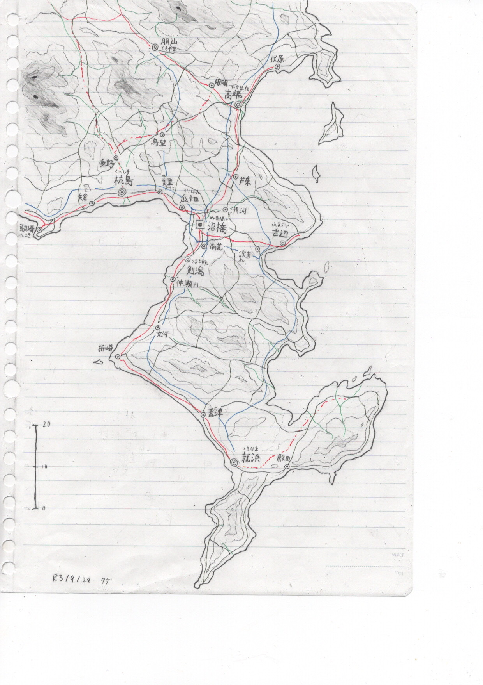 
**地域名称** : なし (沼橋市を中核とする都市圏とその周辺) 
**制作日時** : 2021年9月24日 
**コメント** : 受験期に制作。海岸線と交通網を特に意識。 
 
___
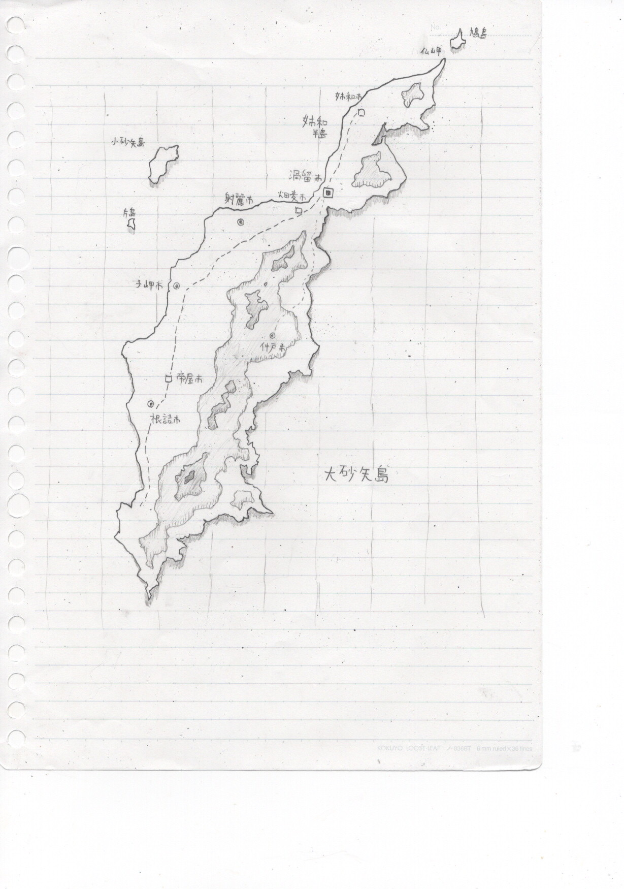 
**地域名称** : 大砂矢島 (おおさやしま) ほか 
**制作日時** : 2021年10月頃 
**コメント** : 受験期に制作。 
___
 
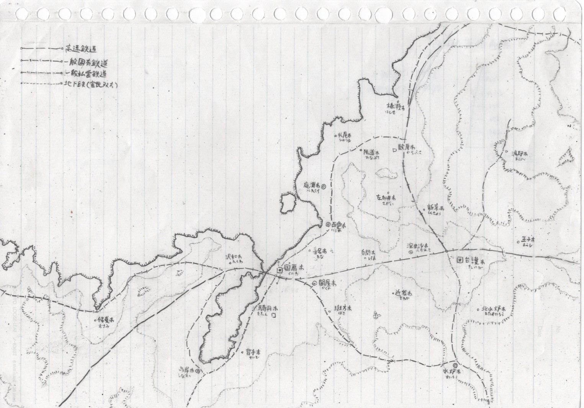 
**地域名称** : なし (国扇市・台護市を中核とする地域) 
**制作日時** : 2021年10月頃 
**コメント** : 受験期に制作。当時、地形の高低差を塗りつぶし無しでいかに表現するかに苦心していた。 
___
 
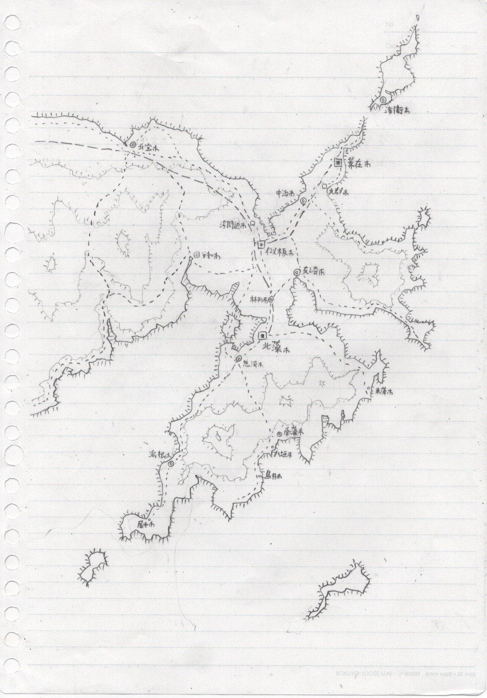 
**地域名称** : なし (似板市・北藻市を中核とする地域) 
**制作日時** : 2021年10月頃 
**コメント** : 受験期に制作。 
___
 
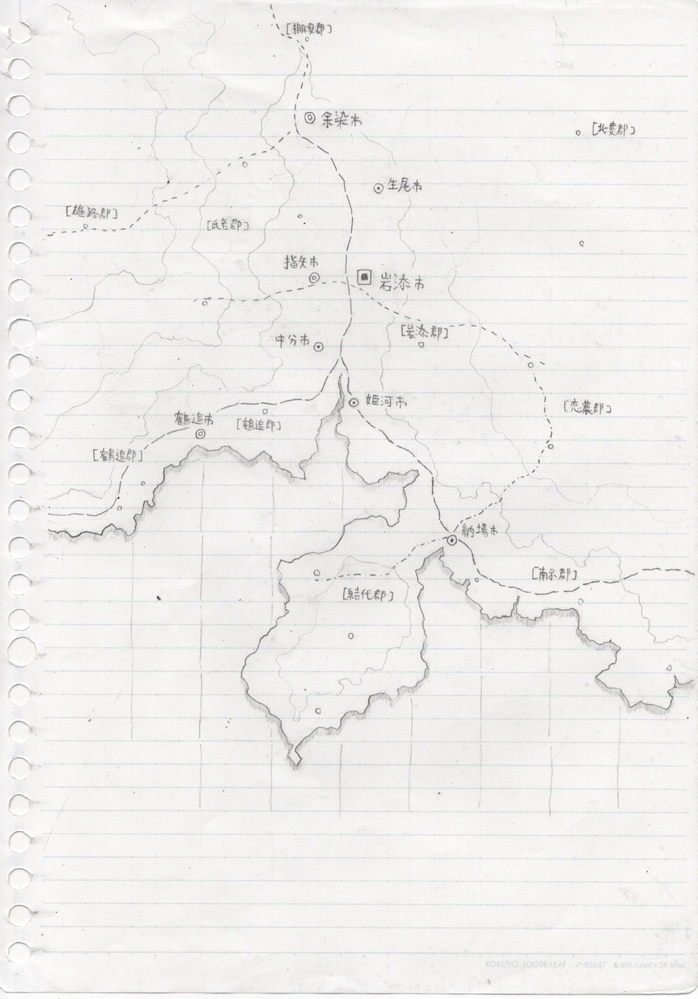 
**地域名称** : なし (岩添市を中核とする都市圏とその周辺) 
**制作日時** : 2021年10月頃 
**コメント** : 受験期に制作。主要都市だけでなく。町村に関する言及も存在するのが特徴。 
___
 
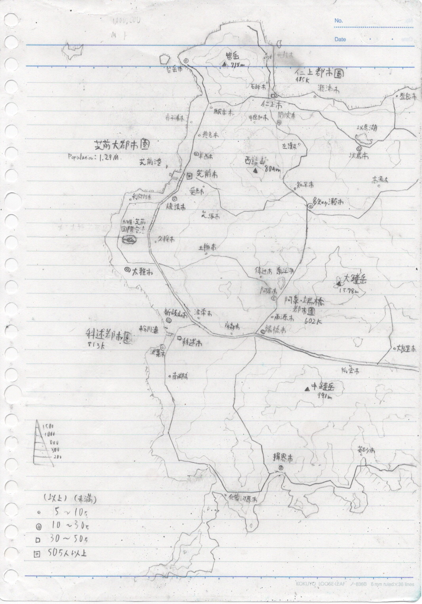 
**地域名称** : 芝前大都市圏・科述(しなのべ)都市圏 ほか 
**制作日時** : 2021年8月頃 
**コメント** : 受験期に制作。受験期の架空地図マイブームのきっかけとなった。空港や高速道路の存在など、交通網のバリエーションを意識。 
___
 
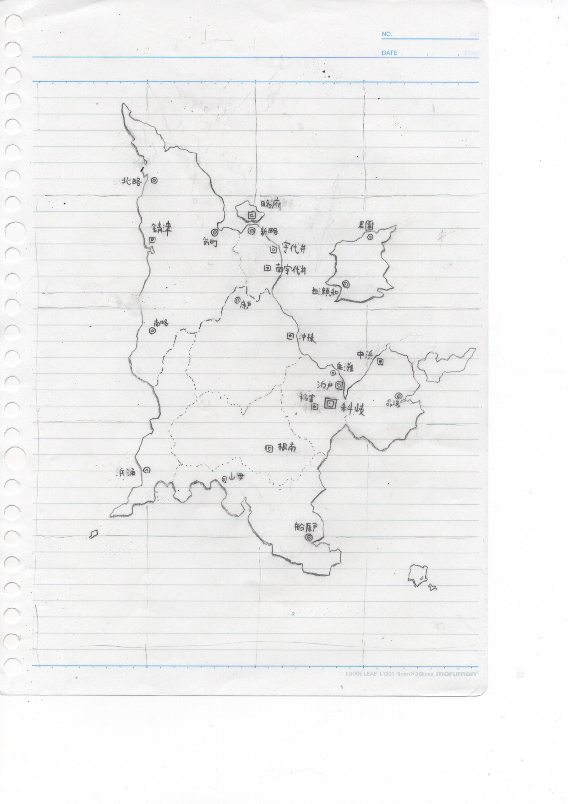 
**地域名称** : 景略連合共和国 
**制作日時** : 2021年8月頃 
**コメント** : 中学時代に描いていた「景略連合共和国」シリーズをリメイクしたもの。最も長く続いたシリーズであったが、資料を保管していなかったため、全国地図はこの地図以外に一つも残っていない。 
___
 
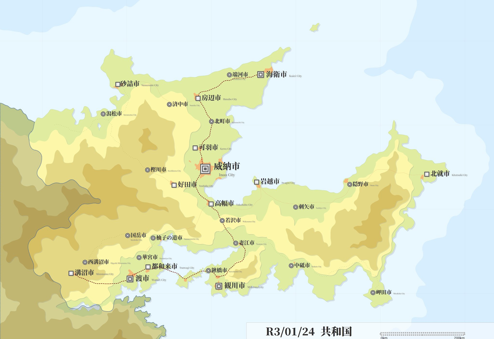 
**地域名称** : R3/01/24共和国 
**制作日時** : 2021/1/24 
**コメント** : 2作目のデジタル作品。観光案内版ライクのわかりやすさを意識。 
___
 
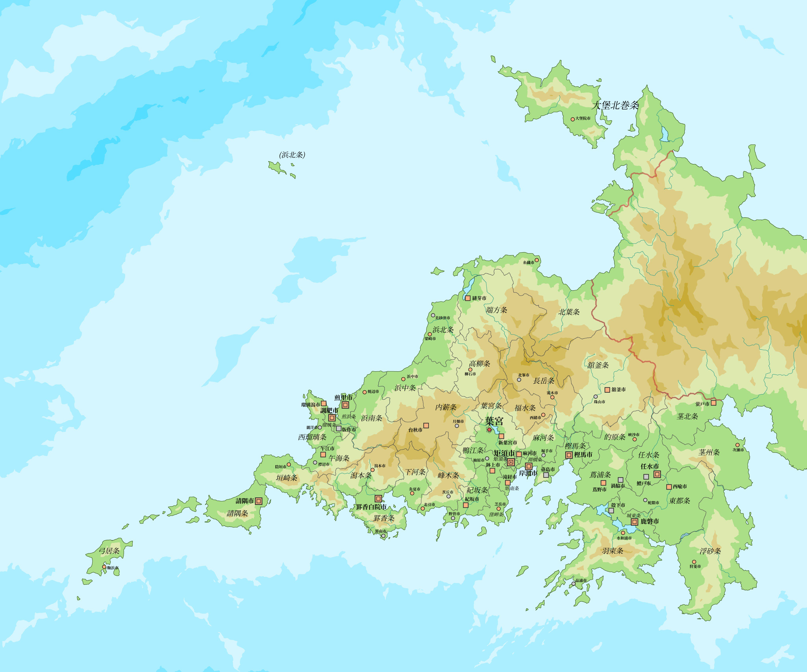 
**地域名称** : 葉州民政共和国(ようしゅうみんせいきょうわこく) 
**制作日時** : 2019/6/1 
**コメント** : 高校時代の本命作。初のデジタル作品。後の架空地図制作スタイルに大きく影響する。 
___
 
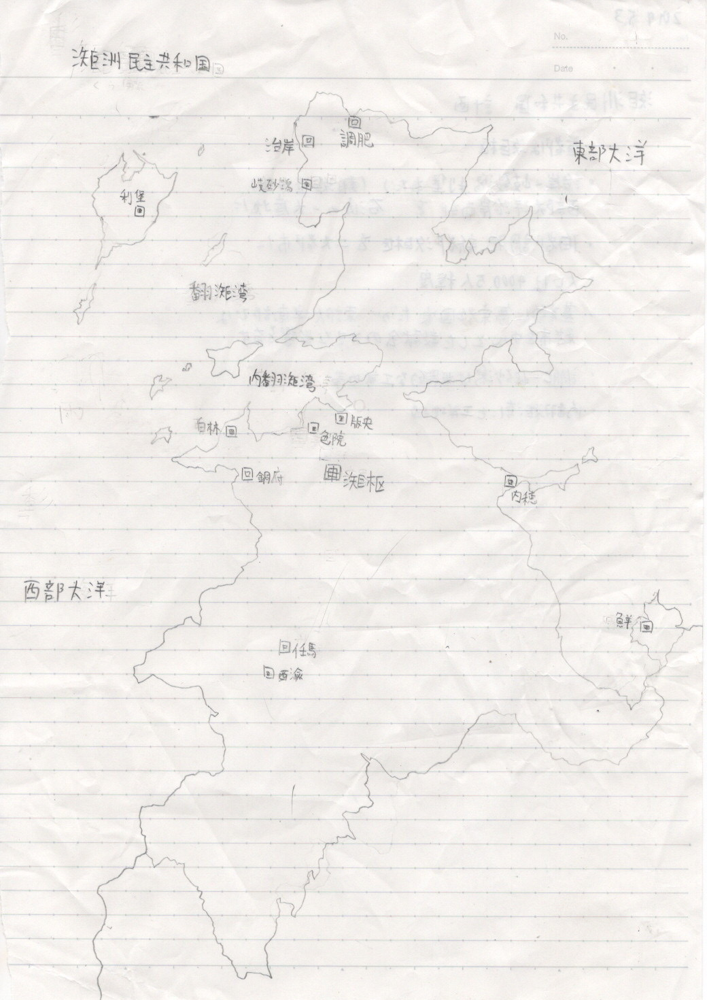 
**地域名称** : [氵矩]須民主共和国 (かねすみんしゅきょうわこく) 
**制作日時** : 2019年5月3日 
**コメント** : 後の高校時代の本命作「葉州民政共和国」の原案にあたるもの。 
___
 
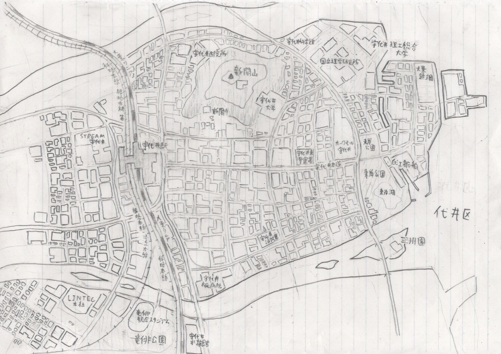 
**地域名称** : 宇代井市 (うつかいし) 
**制作日時** : 2019年1~3月頃 
**コメント** : 「景略連合共和国」内の工業都市「宇代井市」の詳細な地図。 
___
 
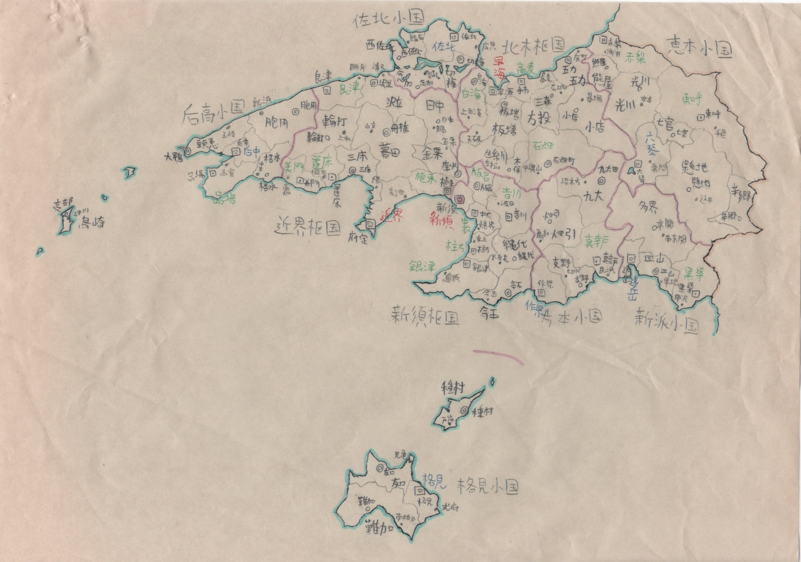 
**地域名称** : 棟国 (棟連邦共和国) 
**制作日時** : 2016~2017年(中学2~3年生)ごろ？ 
**コメント** : 中学時代に描いていた「棟連邦共和国」の全国地図(最終版)。 
___
 
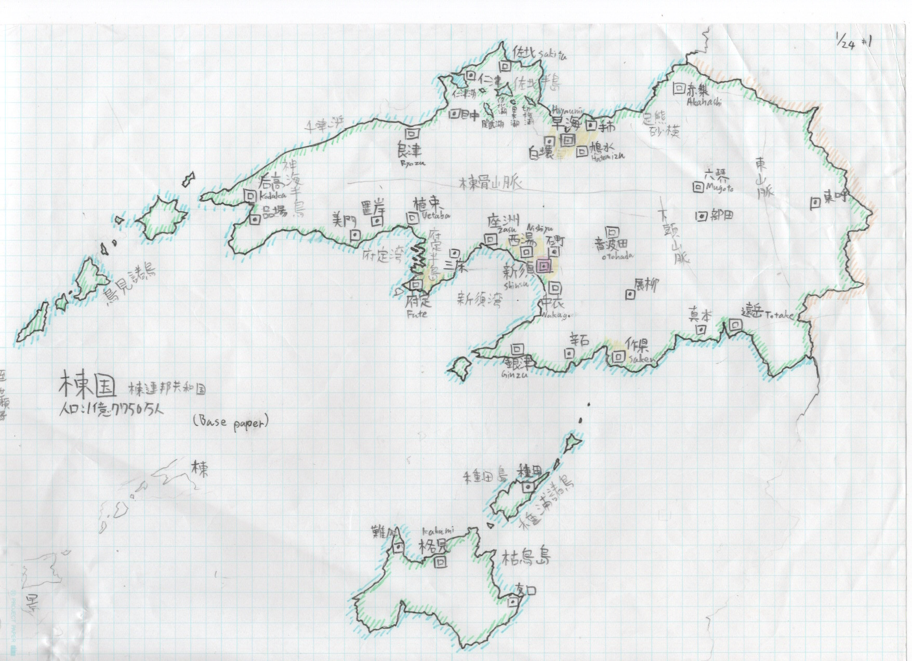 
**地域名称** : 棟国 (棟連邦共和国) 
**制作日時** : 2016~2017年(中学2~3年生)ごろ？ 
**コメント** : 中学時代に描いていた「棟連邦共和国」の全国地図(第2版)。 
___
 
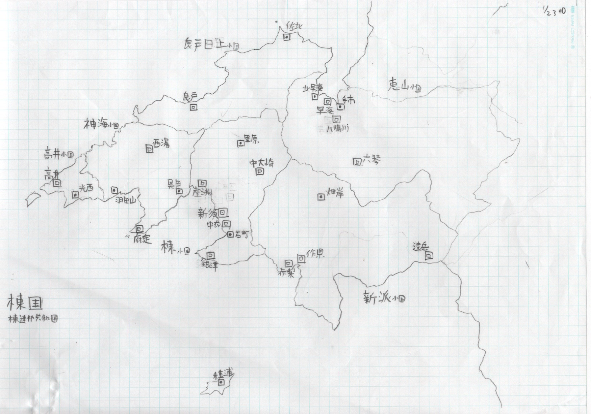 
**地域名称** : 棟国 (棟連邦共和国) 
**制作日時** : 2016~2017年(中学2~3年生)ごろ？ 
**コメント** : 現在残っている最も古い地図。中学時代に描いていた「棟連邦共和国」の全国地図(初版)。 
___ 
 
終 

